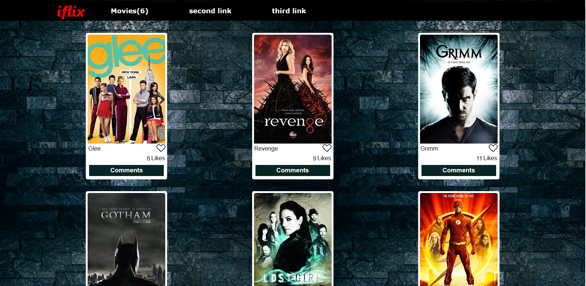

# javascript_capstone

Here is a single page web site we built known as iflix. the porpose of this site was to test our knowledge on HTML, CSS but mostly on JavaScript. the movies are mainly comming from an API (TVMAZE) with the details about the movies. here you can like a movie, check the comments through the pop up and even comment on a movie. you can have a look at our live demo on  [iflix](https://luqmanmusah.github.io/javascript_capstone/).

## Live Demo

this is link to our live Demo [Live Demo](https://luqmanmusah.github.io/javascript_capstone/)

Here is a short [video demo](https://drive.google.com/file/d/1KVvZPCVzUw1rDxo7jHRvn836m3Co1C1Y/view?usp=sharing)
## Languages and tools

- HTML
- CSS
- Javascript
- webpack
- jest
- eslint

## install

- run the command 'git clone https://github.com/luqmanmusah/javascript_capstone.git' on your terminal
- open the project on your IDE
- open the terminal and run 'npm install'
- then run 'npm run build'
- finally run 'npm start'

## Authors

👤 **Caleb Moses**

- Github: [@m05e5](https://github.com/m05e5)
- Linkedin: [caleb Moses](https://www.linkedin.com/in/caleb-moses-0a1b531b9/)

👤 **luqmanmusah**
- GitHub: [@luqmanmusah](https://github.com/luqmanmusah)
- LinkedIn: [Luqman Musah](https://www.linkedin.com/in/luqman-musah/)
## Show your support

Give a ⭐️ if you like this project!

## 📝 License

This project is MIT Lisenced
